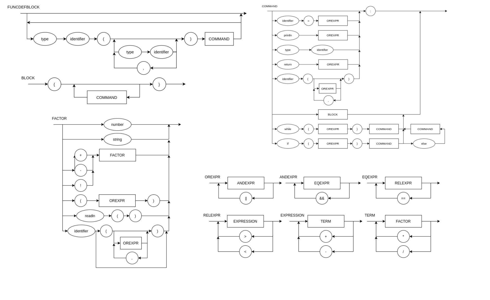

# pvf-language
A self-made programming language. This language was made throughout the 7th semester subject **Programming Logic** given by the teacher MACIEL CALEBE VIDAL.

## Motivation


## Language characteristics

## EBNF


```md
BLOCK = { COMMAND } ; 
COMMAND = ( λ | ASSIGNMENT | PRINT | IF | ELSE | WHILE), ";" ; 
FUNCDEFBLOCK = { IDENTIFIER, TYPE,  "(", { IDENTIFIER, TYPE, "," }, ")", COMMAND }
ASSIGNMENT = IDENTIFIER, "=", EXPRESSION ; 
COMPARISON = EXPRESSION, ("==" | "<" | ">" | "<=" | ">="), EXPRESSION ;
PRINT = "printo", "(", EXPRESSION, ")" ; 
IF = "ifo", "(", COMPARISON, ")", "{", BLOCK, "}", { ESLSE } ;
ELSE = "elso", "{", BLOCK "}" ;
WHILE = "whilo", "(", COMPARISON, ")", "{", BLOCK, "}" ;
EXPRESSION = TERM, { ("+" | "-"), TERM } ; 
TERM = FACTOR, { ("*" | "/"), FACTOR } ; 
FACTOR = (("+" | "-"), FACTOR) | NUMBER | "(", EXPRESSION, ")" | IDENTIFIER ;
IDENTIFIER = LETTER, { LETTER | DIGIT | "_" } ; 
NUMBER = DIGIT, { DIGIT } ; 
LETTER = ( a | ... | z | A | ... | Z ) ; 
DIGIT = ( 1 | 2 | 3 | 4 | 5 | 6 | 7 | 8 | 9 | 0 ) ; 
```

## Sintax Diagram

